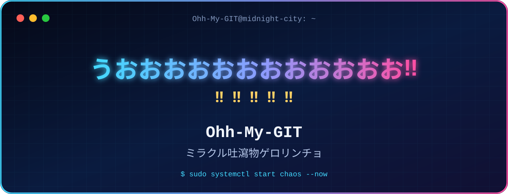

<!--  Ohh-My-GIT profile README -->

<div align="center">
  
</div>

<h1 align="center">うおおおおおおおおおおおお‼️‼️‼️‼️‼️</h1>

<p align="center">
  <strong>Ohh-My-GIT</strong><br>
  ミラクル吐瀉物ゲロリンチョ
</p>

<p align="center">💩 💩 💩 💩 💩 💩 💩 💩 💩</p>

<!-- 増減したいときはこのブロックだけ編集  -->
<p align="center">
  
  
  
  
  
</p>

---

<!--  TERMINAL PROFILE  -->
## `~/WHOAMI`

```console
Ohh-My-GIT@midnight-city:~$ whoami
ミラクル吐瀉物ゲロリンチョ

Ohh-My-GIT@midnight-city:~$ cat interests.txt
JavaScript 大好き。たまにPython 
Linux / Ubuntu とターミナルに生息してる
変なコードとネタコードを製造中。

Ohh-My-GIT@midnight-city:~$ uptime --brain
深夜テンションで稼働中 / 正気はメンテナンス中
```

> [!CAUTION]
> **緊急速報**  
> オナラ出ちゃった  
> **被害状況：** なし　　**犯人：** 不明

<!--  JAVASCRIPT SKIT  -->
## `JavaScript.exe` 起動

**JavaとScriptがmerge！**

### どーーーーん‼️‼️‼️‼️‼️

### ででーん！ JavaScript～～～～～！！！

| 登場人物 | 証言 |
|---|---|
| Java | 「えっ」 |
| Script | 「えっ」 |
| Git | 「mergeします」 |
| JavaScript | 「産まれました」 |
| Java | 「誰？」 |
| JavaScript | 「知らん」 |

> **念のため真面目な注釈：** これは完全に茶番です。JavaScriptは、JavaとScriptをmergeして作られた言語ではありません。JavaとJavaScriptは別物です。

---

<!-- 名言（かも） -->
<div align="center">

## 🌙 なんか誕生した名言 (多分) 🌙

### 「undefinedはファンサだと思え」

— **ミラクル吐瀉物ゲロリンチョ**

`console.log は心の叫び。`

</div>

---

<!-- 技術情報はここに集約  -->
## 🚨 ここから急に真面目です

### 技術スタック

<div align="center">
  
</div>

| 分野 | 使っているもの |
|---|---|
| Languages | JavaScript / Python / HTML / CSS |
| Environment | Linux / Ubuntu / Terminal |
| Tools | Git / GitHub / Codex |
| Learning & Building | 役に立たない変なツール / ネタコード |
| Hidden Skill | うんこ |

### 現在地

- JavaScriptで変で笑えるコードを書いてる（たまに真面目）
- Pythonも巻き込まれてネタ化
- Linuxとターミナルを日常的に使用
- 読めるコードと、読んだら困惑するコードの両方を育成中
- Vibe Coding NOWWWW　❗

### AI・LLM　Lover

> GitHub Statsカードは、外部サービス停止による壊れた画像を避けるため置いていません。

### 真面目タイム終了

<div align="center"><h2>💩</h2></div>

<!-- ALIASES  -->
## `KNOWN ALIASES`

- 便器の妖精クソリータ
- ウンコプリンセス・ブリブリーナ
- オナラ聖女 屁イリー・ブリリ
- 寝不足トロピカルレゲエミラクルゲロゲロカスプリンセス
- ドブ川令嬢
> ※増える可能性あり

```yaml
CURRENT_FORM: 寝不足トロピカルレゲエミラクルゲロゲロカスプリンセス
STATUS:       形態維持に失敗
NEXT_FORM:    undefined
```

<!-- 実際のGitHub履歴ではありません  -->
## `LATEST ACTIVITY --probably-fake`

```diff
+ 文句を commit しました
+ 愚痴を push しました
- やる気を stash しました
! 人生で conflict が発生しました
+ 寝不足を main に統合しました
```

<!-- リンク禁止、架空と明記  -->
## `LAB / 存在しないプロジェクト`

| プロジェクト | 状態 |
|---|---|
| `うんちブリ子の大冒険` | 研究中（存在しません） |
| `文句製造機` | 要件定義だけがブチギレています |
| ~~オナラ出ちゃった~~ | 被害状況なしにつきclose |

> 上記はネタです。存在しないリポジトリへのリンクはありません。

---

> 一応言っておきますが、普段は**様子のおかしい真面目な変人**です
> 
> **ここで事実:** つらさや悲しさが天元突破すると、ふざけたくなるものです。人類は単純ではありません。バグだらけでなぜそれで動いているのかが不思議なコードです。


<!-- ENDING  -->
<div align="center">

ここまでREADMEを読んでくれてありがとうございました。

**特に得られるものはありません。**

文句をcommitして、正気をrevertして帰ってください。

### 💩

`Ohh-My-GIT@midnight-city:~$ exit --code=undefined`

</div>

